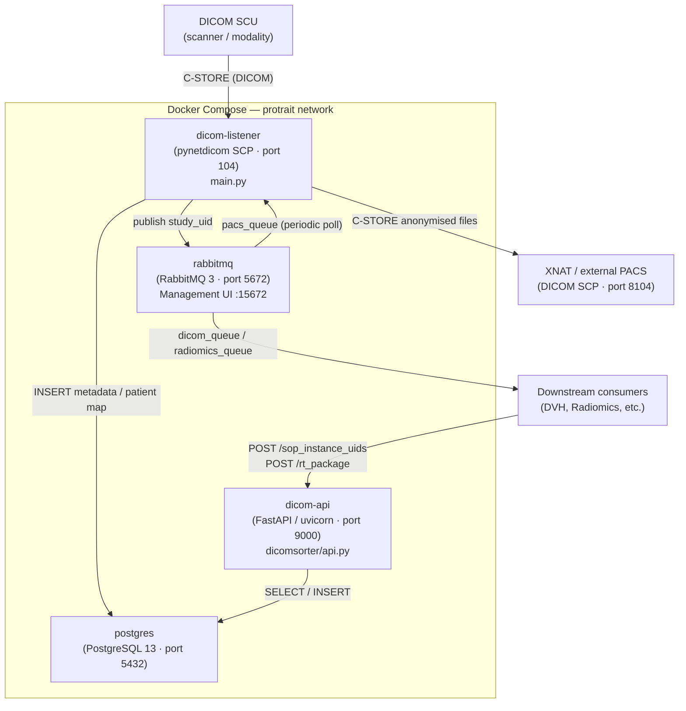
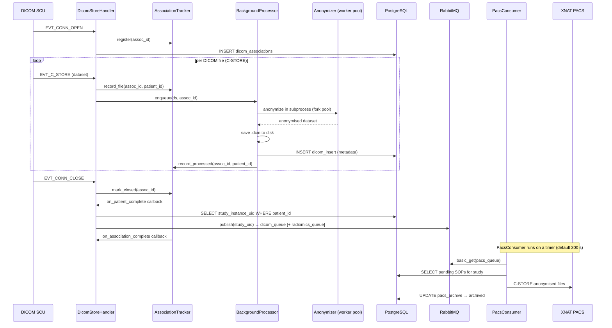
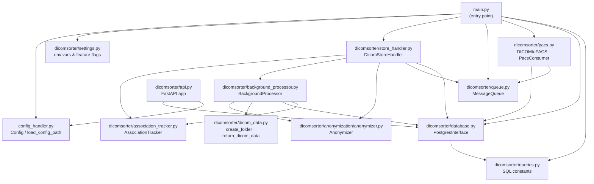

# Architecture Diagrams

## System Architecture

```mermaid
flowchart TD
    SCU["DICOM SCU\n(scanner / modality)"]

    subgraph docker["Docker Compose — protrait network"]
        LISTENER["dicom-listener\n(pynetdicom SCP · port 104)\nmain.py"]
        API["dicom-api\n(FastAPI / uvicorn · port 9000)\ndicomsorter/api.py"]
        MQ["rabbitmq\n(RabbitMQ 3 · port 5672)\nManagement UI :15672"]
        PG["postgres\n(PostgreSQL 13 · port 5432)"]
    end

    XNAT["XNAT / external PACS\n(DICOM SCP · port 8104)"]
    DOWNSTREAM["Downstream consumers\n(DVH, Radiomics, etc.)"]

    SCU -- "C-STORE (DICOM)" --> LISTENER
    LISTENER -- "INSERT metadata / patient map" --> PG
    LISTENER -- "publish study_uid" --> MQ
    MQ -- "pacs_queue (periodic poll)" --> LISTENER
    LISTENER -- "C-STORE anonymised files" --> XNAT
    MQ -- "dicom_queue / radiomics_queue" --> DOWNSTREAM
    API -- "SELECT / INSERT" --> PG
    DOWNSTREAM -- "POST /sop_instance_uids\nPOST /rt_package" --> API
```

## Data Flow — DICOM Study Ingestion

```mermaid
sequenceDiagram
    participant SCU as DICOM SCU
    participant SH as DicomStoreHandler
    participant TR as AssociationTracker
    participant BP as BackgroundProcessor
    participant AN as Anonymizer (worker pool)
    participant DB as PostgreSQL
    participant MQ as RabbitMQ
    participant PC as PacsConsumer
    participant XNAT as XNAT PACS

    SCU->>SH: EVT_CONN_OPEN
    SH->>TR: register(assoc_id)
    SH->>DB: INSERT dicom_associations

    loop per DICOM file (C-STORE)
        SCU->>SH: EVT_C_STORE (dataset)
        SH->>TR: record_file(assoc_id, patient_id)
        SH->>BP: enqueue(ds, assoc_id)
        BP->>AN: anonymize in subprocess (fork pool)
        AN-->>BP: anonymised dataset
        BP->>BP: save .dcm to disk
        BP->>DB: INSERT dicom_insert (metadata)
        BP->>TR: record_processed(assoc_id, patient_id)
    end

    SCU->>SH: EVT_CONN_CLOSE
    SH->>TR: mark_closed(assoc_id)

    TR->>SH: on_patient_complete callback
    SH->>DB: SELECT study_instance_uid WHERE patient_id
    SH->>MQ: publish(study_uid) → dicom_queue [+ radiomics_queue]

    TR->>SH: on_association_complete callback

    Note over PC,XNAT: PacsConsumer runs on a timer (default 300 s)
    PC->>MQ: basic_get(pacs_queue)
    PC->>DB: SELECT pending SOPs for study
    PC->>XNAT: C-STORE anonymised files
    PC->>DB: UPDATE pacs_archive → archived
```

## Module Overview

```mermaid
graph TD
    main["main.py\n(entry point)"]
    config["config_handler.py\nConfig / load_config_path"]
    settings["dicomsorter/settings.py\nenv vars & feature flags"]
    sh["dicomsorter/store_handler.py\nDicomStoreHandler"]
    bp["dicomsorter/background_processor.py\nBackgroundProcessor"]
    tr["dicomsorter/association_tracker.py\nAssociationTracker"]
    anon["dicomsorter/anonymization/anonymizer.py\nAnonymizer"]
    mq["dicomsorter/queue.py\nMessageQueue"]
    pacs["dicomsorter/pacs.py\nDICOMtoPACS · PacsConsumer"]
    db["dicomsorter/database.py\nPostgresInterface"]
    queries["dicomsorter/queries.py\nSQL constants"]
    api["dicomsorter/api.py\nFastAPI app"]
    dd["dicomsorter/dicom_data.py\ncreate_folder · return_dicom_data"]

    main --> config
    main --> settings
    main --> sh
    main --> mq
    main --> pacs
    main --> db
    main --> queries

    sh --> tr
    sh --> bp
    sh --> anon
    sh --> mq
    sh --> db

    bp --> anon
    bp --> dd
    bp --> db
    bp --> tr

    pacs --> db
    pacs --> mq

    api --> db
    api --> config

    db --> queries
```
